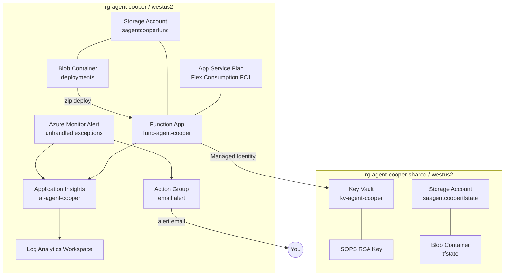
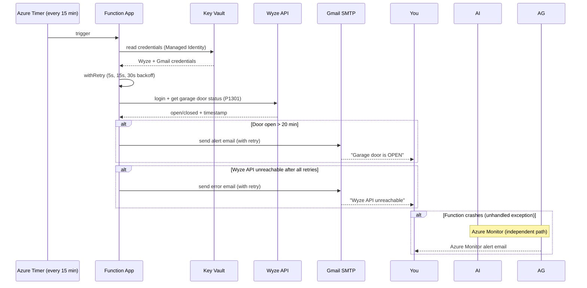
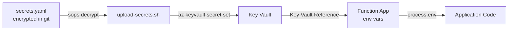
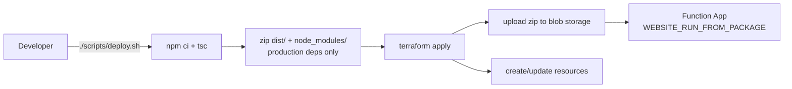
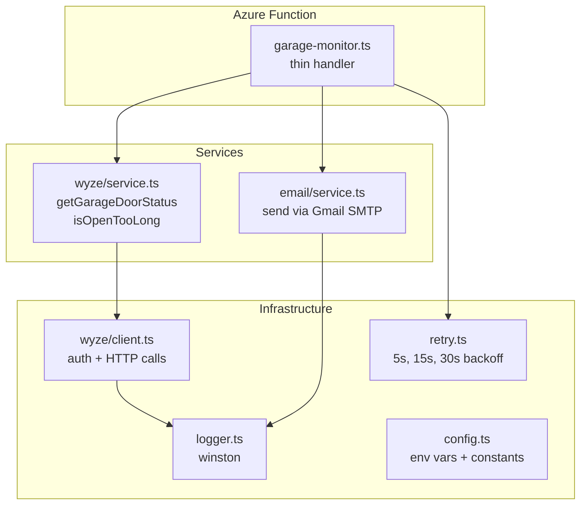

# Architecture

## Azure Resources

```mermaid
graph TB
  subgraph rg-agent-cooper-shared [rg-agent-cooper-shared / westus2]
    KV[Key Vault<br/>kv-agent-cooper]
    SOPS[SOPS RSA Key]
    TFS[Storage Account<br/>saagentcoopertfstate]
    KV --- SOPS
    TFS --- TFC[Blob Container<br/>tfstate]
  end

  subgraph rg-agent-cooper [rg-agent-cooper / westus2]
    ASP[App Service Plan<br/>Flex Consumption FC1]
    SA[Storage Account<br/>sagentcooperfunc]
    FA[Function App<br/>func-agent-cooper]
    AI[Application Insights<br/>ai-agent-cooper]
    LAW[Log Analytics Workspace]
    MON[Azure Monitor Alert<br/>unhandled exceptions]
    AG[Action Group<br/>email alert]

    ASP --- FA
    SA --- FA
    SA --- DC[Blob Container<br/>deployments]
    FA --> AI
    AI --> LAW
    MON --> AI
    MON --> AG
  end

  FA -->|Managed Identity| KV
  DC -->|zip deploy| FA
  AG -->|alert email| USER((You))
```

## Data Flow

```mermaid
sequenceDiagram
  participant Timer as Azure Timer (every 15 min)
  participant Fn as Function App
  participant KV as Key Vault
  participant Wyze as Wyze API
  participant Gmail as Gmail SMTP
  participant You

  Timer->>Fn: trigger
  Fn->>KV: read credentials (Managed Identity)
  KV-->>Fn: Wyze + Gmail credentials

  Fn->>Fn: withRetry (5s, 15s, 30s backoff)
  Fn->>Wyze: login + get garage door status (P1301)
  Wyze-->>Fn: open/closed + timestamp

  alt Door open > 20 min
    Fn->>Gmail: send alert email (with retry)
    Gmail-->>You: "Garage door is OPEN"
  end

  alt Wyze API unreachable after all retries
    Fn->>Gmail: send error email (with retry)
    Gmail-->>You: "Wyze API unreachable"
  end

  alt Function crashes (unhandled exception)
    Note over AI,AG: Azure Monitor (independent path)
    AG-->>You: Azure Monitor alert email
  end
```

## Secrets Flow

```mermaid
graph LR
  SOPS[secrets.yaml<br/>encrypted in git] -->|sops decrypt| US[upload-secrets.sh]
  US -->|az keyvault secret set| KV[Key Vault]
  KV -->|Key Vault Reference| ENV[Function App<br/>env vars]
  ENV -->|process.env| CODE[Application Code]
```

Terraform never touches secret values. No secrets in tfstate.

## Deploy Flow

```mermaid
graph LR
  DEV[Developer] -->|./scripts/deploy.sh| BUILD[npm ci + tsc]
  BUILD --> ZIP[zip dist/ + node_modules/<br/>production deps only]
  ZIP --> TF[terraform apply]
  TF --> BLOB[upload zip to blob storage]
  TF --> INFRA[create/update resources]
  BLOB --> FA[Function App<br/>WEBSITE_RUN_FROM_PACKAGE]
```

## Code Structure

```mermaid
graph TB
  subgraph Azure Function
    GM[garage-monitor.ts<br/>thin handler]
  end

  subgraph Services
    WS[wyze/service.ts<br/>getGarageDoorStatus<br/>isOpenTooLong]
    ES[email/service.ts<br/>send via Gmail SMTP]
  end

  subgraph Infrastructure
    WC[wyze/client.ts<br/>auth + HTTP calls]
    RT[retry.ts<br/>5s, 15s, 30s backoff]
    LG[logger.ts<br/>winston]
    CF[config.ts<br/>env vars + constants]
  end

  GM --> WS
  GM --> ES
  GM --> RT
  WS --> WC
  WC --> LG
  ES --> LG
```
